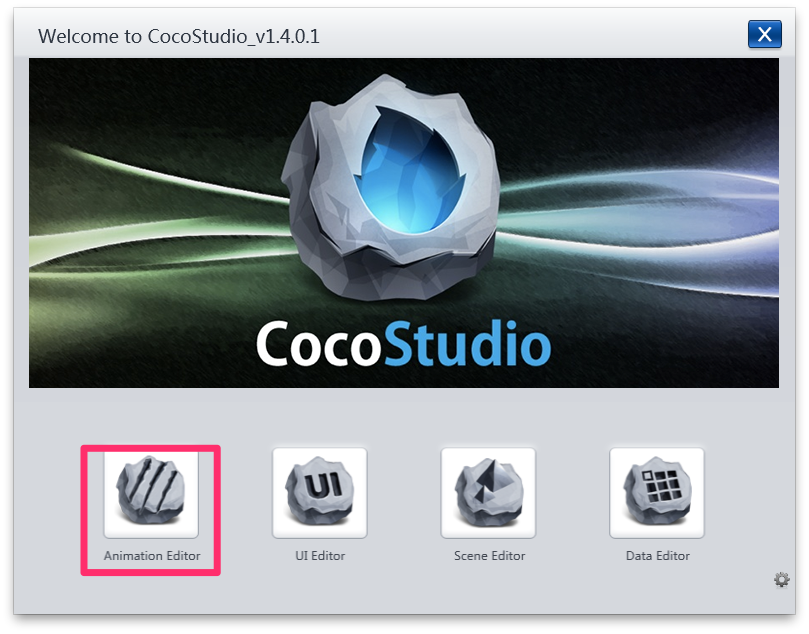
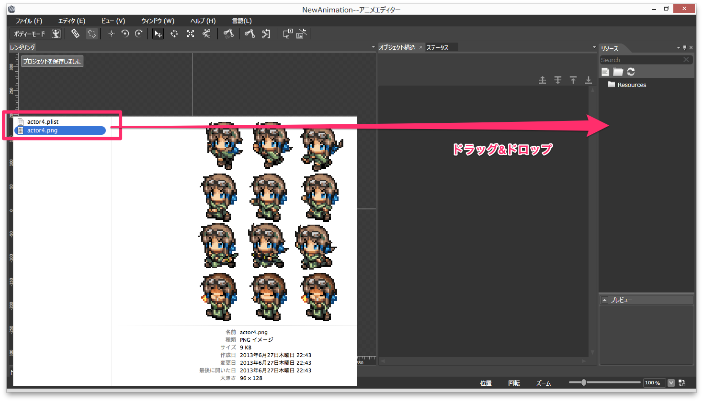
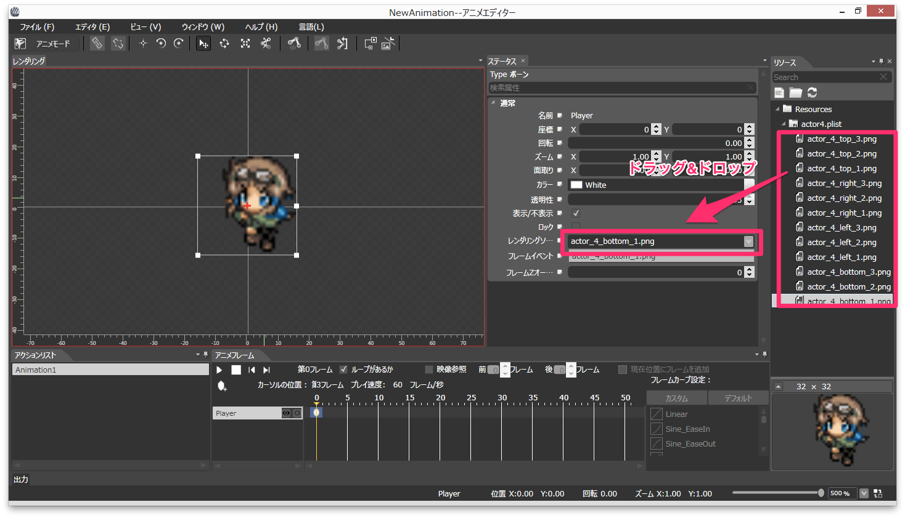
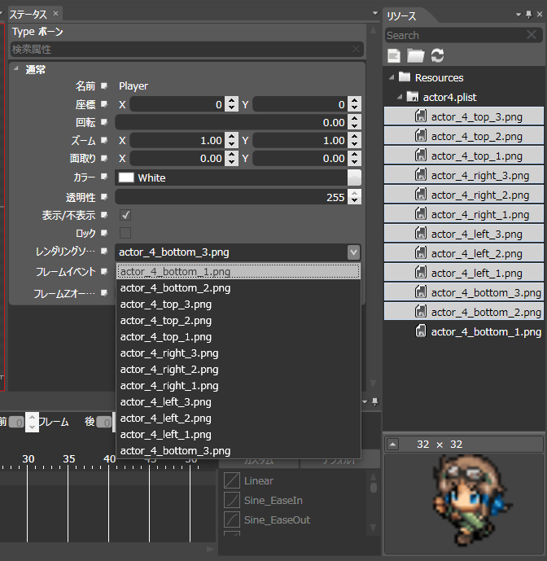
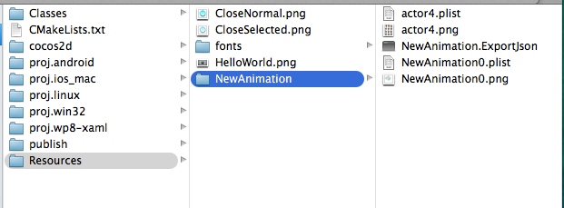
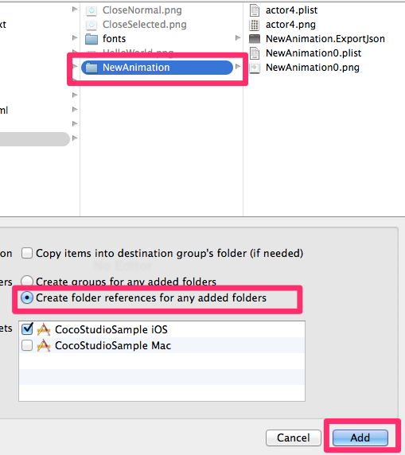

# CocoStudioのAnimationEditorを使ってみる

## はじめに
``CocoStudio``の``Animation Editor``を使って簡単なアニメーションを作成し、
Coso2d-x上で読み込んで実行するまでの説明になります。

## 対応バージョン
- CocoStudio 1.4.0.1（VMFusionでWin8上で起動）
- Cocos2d-x3.1（2014/05/24版）

### 前提条件
- Cocos2d-xの開発環境が整っている
- cocos newコマンドでCocos2d-xプロジェクトを作れる
- Xcodeで起動することができる

こんなもん？足りなかったら指摘ください。。。

## プロジェクトを作成まで

### Animation Editorを起動



### 新規プロジェクトを作成


## SpriteFrameを配置する

元データはこちら。

> 素材提供元 []()

### plistと対になるpngを読み込む

この2ファイルを空プロジェクトのResourceへドラッグ&ドロップします。



### ベースのSpriteを配置

Resourceの中から適当に選んで1つドラック&ドロップします。


## アニメーションを設定

配置したSpriteに対して、フレームの切り替えと移動とカラー変更をタイムラインで制御します。

### アニメモードに切り替える

ここボタンなのか。。。ってくらいわかりにくい感じです。


### フレームイベントを追加する

いまのままだと最初に選んだフレームしかないので、レンダリングリソースの欄へドラッグ&ドロップで追加します。



こんな感じに選べるようになります。



### タイムラインを編集する

Adobe製品とかのタイムラインみたいな感じで直感的にいじれます。
適当に試してみてください。

キャラだけだと味気ないので、エフェクトも追加してこんな感じにしました。


## プロジェクト出力

ここでCocoStudioの操作は終わりです。


## Cocos2d-xプロジェクトへ組み込む

### CocoStudioで出力したファイルを配置

Cocos2d-xのプロジェクト配下にあるResourceディレクトリに、
先ほどCocoStudioから出力したディレクトリを配置します。

NewAnimationってやつです。



### Xcodeで読み込む

この辺は普段ファイル読み込むのと同じです。




## HelloWorldSceneクラスを修正

今回作ったアニメーションを呼び出すようにします。

ちなみにアニメーション終了時にCocos2d-xのHelloWorld画像を吹っ飛ばすようにしました。

```cpp
#include "cocostudio/CocoStudio.h"

using namespace cocostudio;

// 〜省略〜

// on "init" you need to initialize your instance
bool HelloWorld::init()
{
    //////////////////////////////
    // 1. super init first
    if ( !Layer::init() )
    {
        return false;
    }

    Size visibleSize = Director::getInstance()->getVisibleSize();
    Vec2 origin = Director::getInstance()->getVisibleOrigin();

    /////////////////////////////
    // 2. add a menu item with "X" image, which is clicked to quit the program
    //    you may modify it.

    // add a "close" icon to exit the progress. it's an autorelease object
    auto closeItem = MenuItemImage::create(
                                           "CloseNormal.png",
                                           "CloseSelected.png",
                                           CC_CALLBACK_1(HelloWorld::menuCloseCallback, this));

	closeItem->setPosition(Vec2(origin.x + visibleSize.width - closeItem->getContentSize().width/2 ,
                                origin.y + closeItem->getContentSize().height/2));

    // create menu, it's an autorelease object
    auto menu = Menu::create(closeItem, NULL);
    menu->setPosition(Vec2::ZERO);
    this->addChild(menu, 1);

    /////////////////////////////
    // 3. add your codes below...

    // add a label shows "Hello World"
    // create and initialize a label

    auto label = LabelTTF::create("Hello World", "Arial", 24);

    // position the label on the center of the screen
    label->setPosition(Vec2(origin.x + visibleSize.width/2,
                            origin.y + visibleSize.height - label->getContentSize().height));

    // add the label as a child to this layer
    this->addChild(label, 1);

    // add "HelloWorld" splash screen"
    auto sprite = Sprite::create("HelloWorld.png");

    // position the sprite on the center of the screen
    sprite->setPosition(Vec2(visibleSize.width/2 + origin.x - sprite->getContentSize().width/2, visibleSize.height/2 + origin.y));

    // add the sprite as a child to this layer
    this->addChild(sprite, 0);

    // ここから CocoStudio Animationの読み込み
    ArmatureDataManager::getInstance()->addArmatureFileInfo("NewAnimation/NewAnimation.ExportJson");
    Armature *armature = Armature::create("NewAnimation");
    armature->getAnimation()->playWithIndex(0);
    armature->getAnimation()->setMovementEventCallFunc([sprite](Armature *armature, MovementEventType type, const std::string & name) {
        // Animation終了時(LOOP設定したらループごとに呼ばれる）
        sprite->runAction(MoveTo::create(0.2f, Point(-500, sprite->getPositionY())));
    });
    armature->setPosition(Vec2(visibleSize.width/2 + origin.x, visibleSize.height/2 + origin.y));
    this->addChild(armature);

    return true;
}
```

動かしてみるとこんな感じになります。


---
