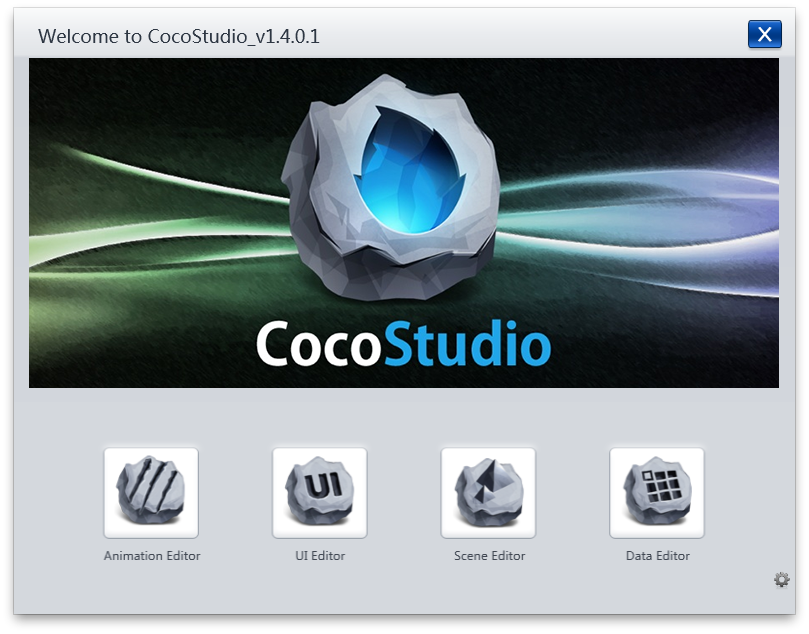
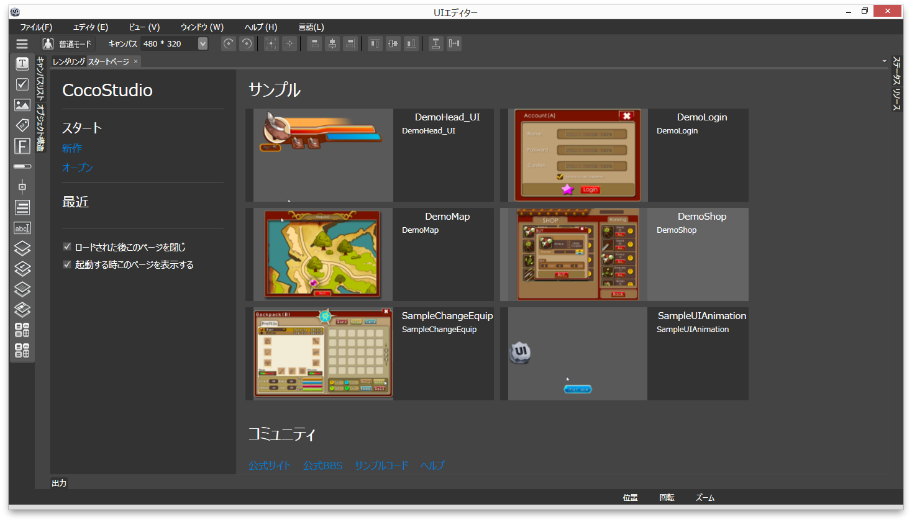
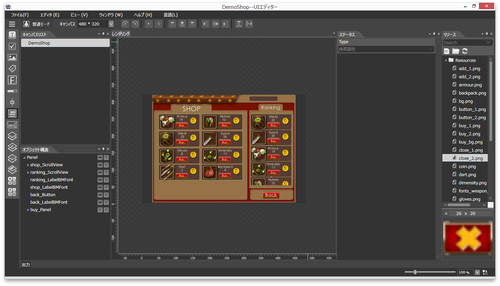
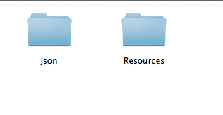
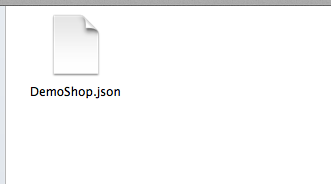
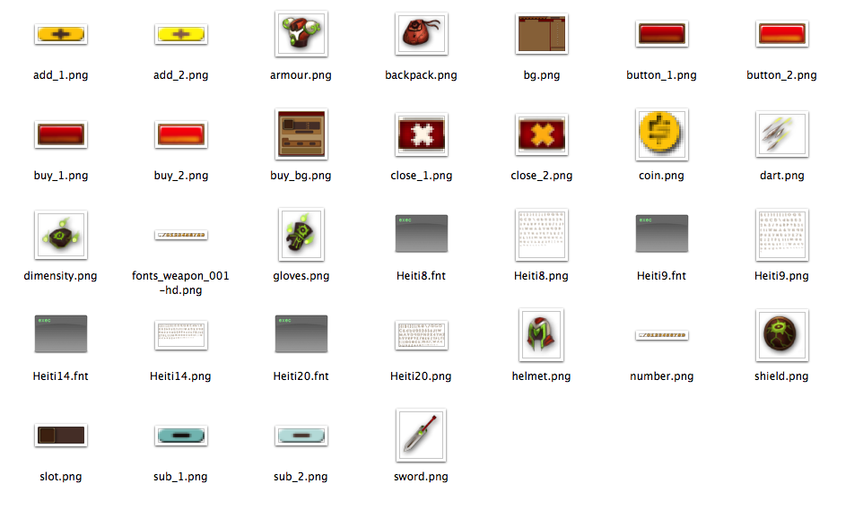
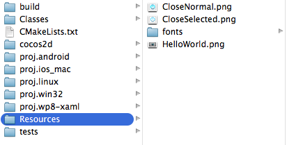
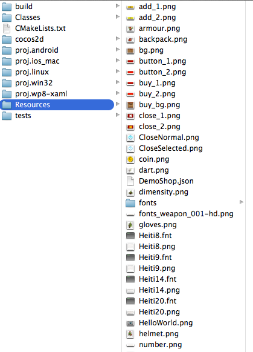
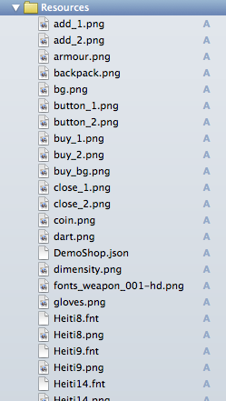
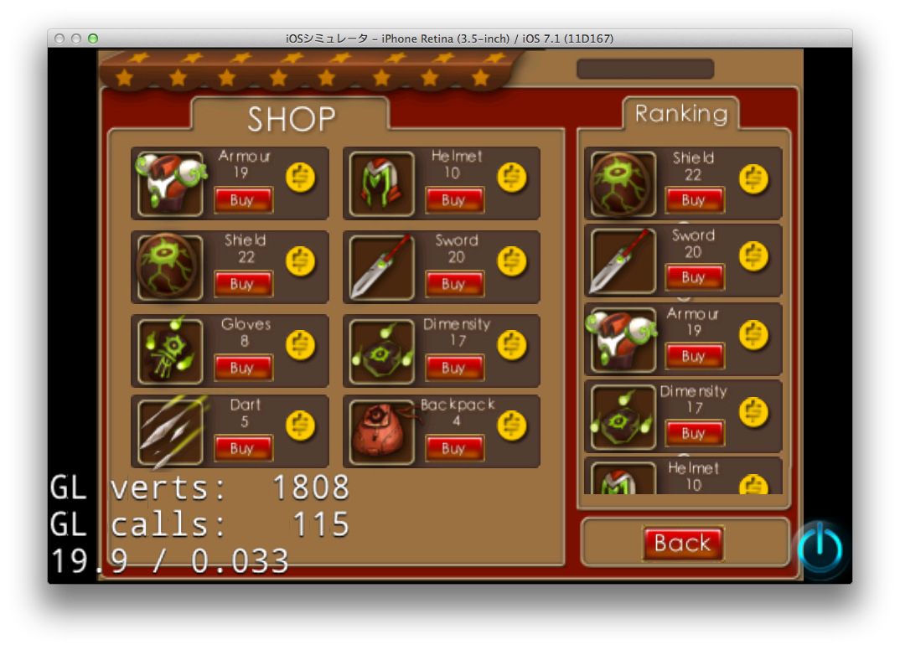

# CocoStudioのUIEditor起動

---
## 起動画面

あああああああああああああああああ



あああああああああああああああああ

---
## UI Editorを起動

あああああああああああああああああ



あああああああああああああああああ

---
## DemoShopのサンプルを起動

あああああああああああああああああ



あああああああああああああああああ

---
## DemoShopのファイル構成

あああああああああああああああああ





あああああああああああああああああ

---
## Cocos2d-xのプロジェクトに組み込む

あああああああああああああああああ





あああああああああああああああああ

---
## 画面サイズは480x320に合わせる

あああああああああああああああああ

#### AppDelegate.cpp

```cpp
bool AppDelegate::applicationDidFinishLaunching() {
    // initialize director
    auto director = Director::getInstance();
    auto glview = director->getOpenGLView();
    if(!glview) {
        glview = GLView::create("My Game");
        director->setOpenGLView(glview);
    }
    // ★追加★
    glview->setDesignResolutionSize(480, 320, ResolutionPolicy::SHOW_ALL);

    // turn on display FPS
    director->setDisplayStats(true);

    // set FPS. the default value is 1.0/60 if you don't call this
    director->setAnimationInterval(1.0 / 60);

    // create a scene. it's an autorelease object
    auto scene = HelloWorld::createScene();

    // run
    director->runWithScene(scene);

    return true;
}
```

## Sceneに追加する

あああああああああああああああああ

#### HelloWorldScene.cpp

```cpp
// on "init" you need to initialize your instance
bool HelloWorld::init()
{
    //////////////////////////////
    // 1. super init first
    if ( !Layer::init() )
    {
        return false;
    }

    Size visibleSize = Director::getInstance()->getVisibleSize();
    Point origin = Director::getInstance()->getVisibleOrigin();

    /////////////////////////////
    // 2. add a menu item with "X" image, which is clicked to quit the program
    //    you may modify it.

    // add a "close" icon to exit the progress. it's an autorelease object
    auto closeItem = MenuItemImage::create(
                                           "CloseNormal.png",
                                           "CloseSelected.png",
                                           CC_CALLBACK_1(HelloWorld::menuCloseCallback, this));

	closeItem->setPosition(Point(origin.x + visibleSize.width - closeItem->getContentSize().width/2 ,
                                origin.y + closeItem->getContentSize().height/2));

    // create menu, it's an autorelease object
    auto menu = Menu::create(closeItem, NULL);
    menu->setPosition(Point::ZERO);
    this->addChild(menu, 1);

    // UI Editorで作ったjsonを読み込んでaddChildする
    auto shopUi = cocostudio::GUIReader::getInstance()->widgetFromJsonFile("DemoShop.json");
    this->addChild(shopUi);

    return true;
}

```

---
## 起動する



あああああああああああああああああ


---
